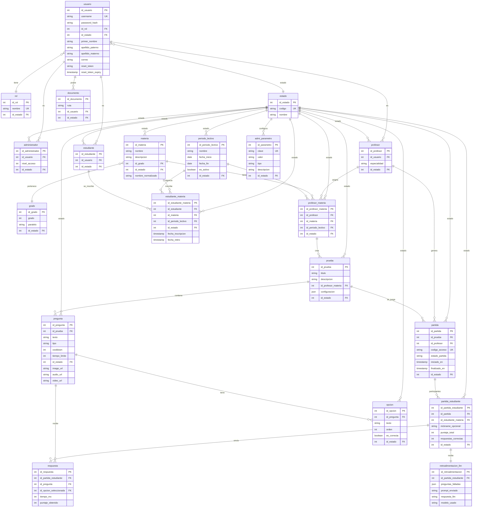

```mermaid
erDiagram
    usuario {
        int id_usuario PK
        string username UK
        string password_hash
        int id_rol FK
        int id_estado FK
        string primer_nombre
        string apellido_paterno
        string apellido_materno
        string correo
        string reset_token
        timestamp reset_token_expiry
    }
    rol {
        int id_rol PK
        string nombre UK
        int id_estado FK
    }
    estado {
        int id_estado PK
        string codigo UK
        string nombre
    }
    administrador {
        int id_administrador PK
        int id_usuario FK
        int nivel_acceso
        int id_estado FK
    }
    profesor {
        int id_profesor PK
        int id_usuario FK
        string especialidad
        int id_estado FK
    }
    estudiante {
        int id_estudiante PK
        int id_usuario FK
        int id_estado FK
    }
    grado {
        int id_grado PK
        int grado
        string paralelo
        int id_estado FK
    }
    materia {
        int id_materia PK
        string nombre
        string descripcion
        int id_grado FK
        int id_estado FK
        string nombre_normalizado
    }
    periodo_lectivo {
        int id_periodo_lectivo PK
        string nombre
        date fecha_inicio
        date fecha_fin
        boolean es_activo
        int id_estado FK
    }
    profesor_materia {
        int id_profesor_materia PK
        int id_profesor FK
        int id_materia FK
        int id_periodo_lectivo FK
        int id_estado FK
    }
    estudiante_materia {
        int id_estudiante_materia PK
        int id_estudiante FK
        int id_materia FK
        int id_periodo_lectivo FK
        int id_estado FK
        timestamp fecha_inscripcion
        timestamp fecha_retiro
    }
    prueba {
        int id_prueba PK
        string titulo
        string descripcion
        int id_profesor_materia FK
        json configuracion
        int id_estado FK
    }
    partida {
        int id_partida PK
        int id_prueba FK
        int id_profesor FK
        string codigo_acceso UK
        string estado_partida
        timestamp iniciado_en
        timestamp finalizado_en
        int id_estado FK
    }
    partida_estudiante {
        int id_partida_estudiante PK
        int id_partida FK
        int id_estudiante_materia FK
        string nickname_opcional
        int puntaje_total
        int respuestas_correctas
        int id_estado FK
    }
    pregunta {
        int id_pregunta PK
        int id_prueba FK
        string texto
        string tipo
        int cooldown
        int tiempo_limite
        int id_estado FK
        string image_url
        string audio_url
        string video_url
    }
    opcion {
        int id_opcion PK
        int id_pregunta FK
        string texto
        int orden
        boolean es_correcta
        int id_estado FK
    }
    respuesta {
        int id_respuesta PK
        int id_partida_estudiante FK
        int id_pregunta FK
        int id_opcion_seleccionada FK
        int tiempo_ms
        int puntaje_obtenido
    }
    retroalimentacion_llm {
        int id_retroalimentacion PK
        int id_partida_estudiante FK
        json preguntas_falladas
        string prompt_enviado
        string respuesta_llm
        string modelo_usado
    }
    admi_parametro {
        int id_parametro PK
        string clave UK
        string valor
        string tipo
        string descripcion
        int id_estado FK
    }
    documento {
        int id_documento PK
        string ruta
        int id_usuario FK
        int id_estado FK
    }

    usuario ||--o{ administrador : "es"
    usuario ||--o{ profesor : "es"
    usuario ||--o{ estudiante : "es"
    usuario ||--o{ documento : "posee"
    usuario }o--|| rol : "tiene"
    usuario }o--|| estado : "estado"

    estado ||--o{ admi_parametro : "configura"
    estado ||--o{ materia : "estado"
    estado ||--o{ prueba : "estado"
    estado ||--o{ partida : "estado"
    estado ||--o{ partida_estudiante : "estado"
    estado ||--o{ pregunta : "estado"
    estado ||--o{ opcion : "estado"
    estado ||--o{ periodo_lectivo : "estado"
    estado ||--o{ profesor_materia : "estado"
    estado ||--o{ estudiante_materia : "estado"
    estado ||--o{ administrador : "estado"
    estado ||--o{ profesor : "estado"
    estado ||--o{ estudiante : "estado"

    profesor ||--o{ profesor_materia : "asigna"
    profesor ||--o{ partida : "genera"

    materia ||--o{ profesor_materia : "tiene"
    materia ||--o{ estudiante_materia : "inscribe"
    materia }o--|| grado : "pertenece"

    periodo_lectivo ||--o{ profesor_materia : "vigencia"
    periodo_lectivo ||--o{ estudiante_materia : "vigencia"

    profesor_materia ||--o{ prueba : "crea"

    prueba ||--o{ partida : "se_juega"
    prueba ||--o{ pregunta : "contiene"

    pregunta ||--o{ opcion : "tiene"
    pregunta ||--o{ respuesta : "recibe"

    partida ||--o{ partida_estudiante : "participantes"
    partida_estudiante ||--o{ respuesta : "envía"
    partida_estudiante ||--|| retroalimentacion_llm : "recibe"

    estudiante ||--o{ estudiante_materia : "se_inscribe"
```
