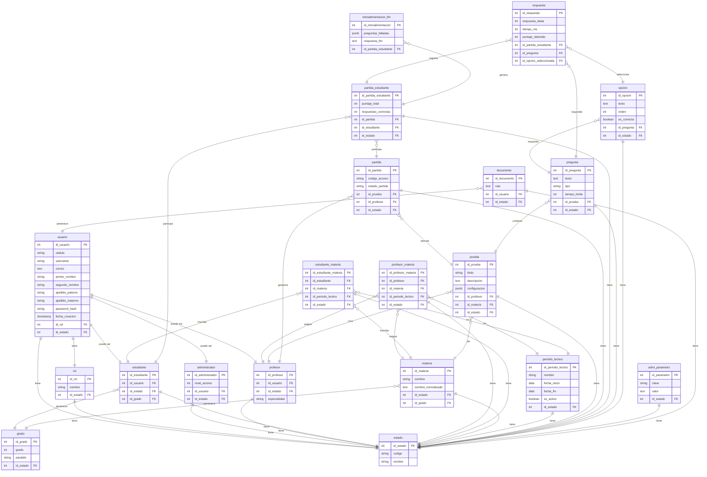

# Modelo Entidad-Relación eduLLM

```mermaid
erDiagram
    usuario {
        int id_usuario PK
        string cedula
        string username
        text correo
        string primer_nombre
        string segundo_nombre
        string apellido_paterno
        string apellido_materno
        string password_hash
        timestamp fecha_creacion
        int id_rol FK
        int id_estado FK
    }
    
    rol {
        int id_rol PK
        string nombre
        int id_estado FK
    }
    
    estado {
        int id_estado PK
        string codigo
        string nombre
    }
    
    administrador {
        int id_administrador PK
        int nivel_acceso
        int id_usuario FK
        int id_estado FK
    }
    
    profesor {
        int id_profesor PK
        int id_usuario FK
        int id_estado FK
        string especialidad
    }
    
    estudiante {
        int id_estudiante PK
        int id_usuario FK
        int id_estado FK
        int id_grado FK
    }
    
    grado {
        int id_grado PK
        int grado
        string paralelo
        int id_estado FK
    }
    
    periodo_lectivo {
        int id_periodo_lectivo PK
        string nombre
        date fecha_inicio
        date fecha_fin
        boolean es_activo
        int id_estado FK
    }
    
    materia {
        int id_materia PK
        string nombre
        text nombre_normalizado
        int id_estado FK
        int id_grado FK
    }
    
    profesor_materia {
        int id_profesor_materia PK
        int id_profesor FK
        int id_materia FK
        int id_periodo_lectivo FK
        int id_estado FK
    }
    
    estudiante_materia {
        int id_estudiante_materia PK
        int id_estudiante FK
        int id_materia FK
        int id_periodo_lectivo FK
        int id_estado FK
    }
    
    prueba {
        int id_prueba PK
        string titulo
        text descripcion
        jsonb configuracion
        int id_profesor FK
        int id_materia FK
        int id_estado FK
    }
    
    partida {
        int id_partida PK
        string codigo_acceso
        string estado_partida
        int id_prueba FK
        int id_profesor FK
        int id_estado FK
    }
    
    partida_estudiante {
        int id_partida_estudiante PK
        int puntaje_total
        int respuestas_correctas
        int id_partida FK
        int id_estudiante FK
        int id_estado FK
    }
    
    pregunta {
        int id_pregunta PK
        text texto
        string tipo
        int tiempo_limite
        int id_prueba FK
        int id_estado FK
    }
    
    opcion {
        int id_opcion PK
        text texto
        int orden
        boolean es_correcta
        int id_pregunta FK
        int id_estado FK
    }
    
    respuesta {
        int id_respuesta PK
        int respuesta_dada
        int tiempo_ms
        int puntaje_obtenido
        int id_partida_estudiante FK
        int id_pregunta FK
        int id_opcion_seleccionada FK
    }
    
    retroalimentacion_llm {
        int id_retroalimentacion PK
        jsonb preguntas_falladas
        text respuesta_llm
        int id_partida_estudiante FK
    }
    
    admi_parametro {
        int id_parametro PK
        string clave
        text valor
        int id_estado FK
    }
    
    documento {
        int id_documento PK
        text ruta
        int id_usuario FK
        int id_estado FK
    }
    

    %% Relaciones
    usuario ||--|| rol : "tiene"
    usuario ||--|| estado : "tiene"
    rol ||--|| estado : "tiene"
    
    usuario ||--|| administrador : "puede ser"
    usuario ||--|| profesor : "puede ser"
    usuario ||--|| estudiante : "puede ser"
    
    administrador ||--|| estado : "tiene"
    profesor ||--|| estado : "tiene"
    estudiante ||--|| estado : "tiene"
    
    estudiante }o--|| grado : "pertenece"
    
    profesor_materia }o--|| profesor : "asigna"
    profesor_materia }o--|| materia : "asigna"
    profesor_materia }o--|| periodo_lectivo : "en"
    profesor_materia ||--|| estado : "tiene"
    
    estudiante_materia }o--|| estudiante : "inscribe"
    estudiante_materia }o--|| materia : "inscribe"
    estudiante_materia }o--|| periodo_lectivo : "en"
    estudiante_materia ||--|| estado : "tiene"
    
    materia }o--|| grado : "pertenece"
    materia ||--|| estado : "tiene"
    periodo_lectivo ||--|| estado : "tiene"
    
    prueba }o--|| profesor : "crea"
    prueba }o--|| materia : "de"
    prueba ||--|| estado : "tiene"
    
    partida }o--|| prueba : "ejecuta"
    partida }o--|| profesor : "gestiona"
    partida ||--|| estado : "tiene"
    
    partida_estudiante }o--|| partida : "participa"
    partida_estudiante }o--|| estudiante : "participa"
    partida_estudiante ||--|| estado : "tiene"
    
    pregunta }o--|| prueba : "contiene"
    pregunta ||--|| estado : "tiene"
    
    opcion }o--|| pregunta : "responde"
    opcion ||--|| estado : "tiene"
    
    respuesta }o--|| partida_estudiante : "registra"
    respuesta }o--|| pregunta : "responde"
    respuesta }o--|| opcion : "selecciona"
    
    retroalimentacion_llm }o--|| partida_estudiante : "genera"
    
    admi_parametro ||--|| estado : "tiene"
    documento }o--|| usuario : "pertenece"
    documento ||--|| estado : "tiene"

```
