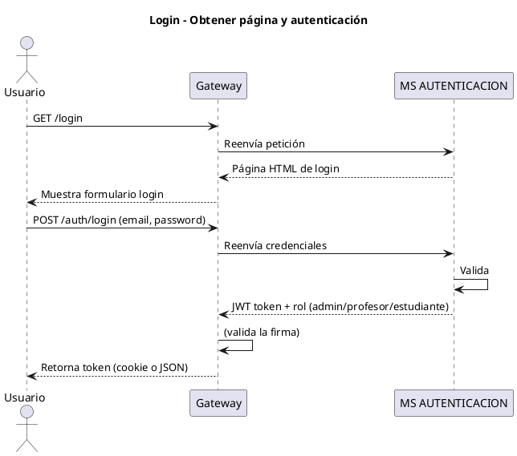

# Login - Obtener página y autenticación

```plantuml
@startuml
title Login - Obtener página y autenticación

actor Usuario as user
participant "Gateway" as gw
participant "MS AUTENTICACION" as auth

user -> gw: GET /login
gw -> auth: Reenvía petición
auth --> gw: Página HTML de login
gw --> user: Muestra formulario login

user -> gw: POST /auth/login (email, password)
gw -> auth: Reenvía credenciales
auth -> auth: Valida
auth --> gw: JWT token + rol (admin/profesor/estudiante)
gw -> gw: (valida la firma)
gw --> user: Retorna token (cookie o JSON)
@enduml
```

---
[⬅️ Volver al Índice (INDEX.md)](../INDEX.md) | [🏠 Volver al Inicio (README.md)](../README.md)
