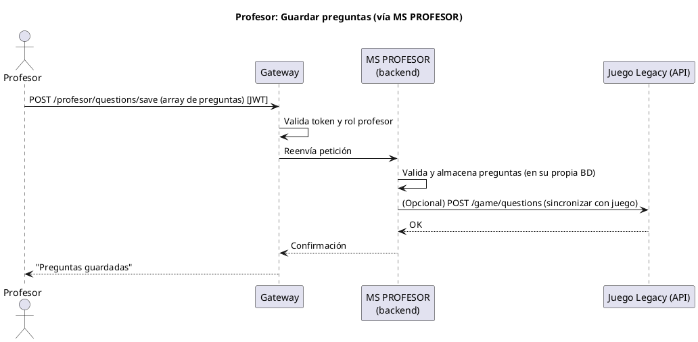

# Profesor: Guardar preguntas (vía MS PROFESOR)

```plantuml
@startuml
title Profesor: Guardar preguntas (vía MS PROFESOR)

actor Profesor as prof
participant "Gateway" as gw
participant "MS PROFESOR\n(backend)" as msprof
participant "Juego Legacy (API)" as legacy

prof -> gw: POST /profesor/questions/save (array de preguntas) [JWT]
gw -> gw: Valida token y rol profesor
gw -> msprof: Reenvía petición
msprof -> msprof: Valida y almacena preguntas (en su propia BD)
msprof -> legacy: (Opcional) POST /game/questions (sincronizar con juego)
legacy --> msprof: OK
msprof --> gw: Confirmación
gw --> prof: "Preguntas guardadas"
@enduml
```

---
[⬅️ Volver al Índice (INDEX.md)](../INDEX.md) | [🏠 Volver al Inicio (README.md)](../README.md)
