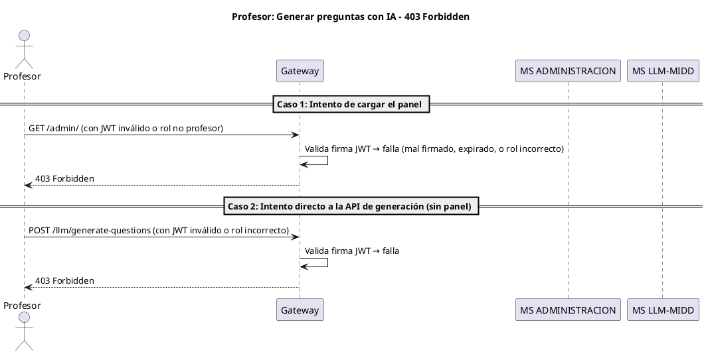

# Profesor: Generar preguntas con IA - 403 Forbidden

```plantuml
@startuml
title Profesor: Generar preguntas con IA - 403 Forbidden

actor Profesor as prof
participant "Gateway" as gw
participant "MS ADMINISTRACION" as adminweb
participant "MS LLM-MIDD" as llmmid

== Caso 1: Intento de cargar el panel ==
prof -> gw: GET /admin/ (con JWT inválido o rol no profesor)
gw -> gw: Valida firma JWT → falla (mal firmado, expirado, o rol incorrecto)
gw --> prof: 403 Forbidden

== Caso 2: Intento directo a la API de generación (sin panel) ==
prof -> gw: POST /llm/generate-questions (con JWT inválido o rol incorrecto)
gw -> gw: Valida firma JWT → falla
gw --> prof: 403 Forbidden
@enduml
```

---
[⬅️ Volver al Índice (INDEX.md)](../INDEX.md) | [🏠 Volver al Inicio (README.md)](../README.md)
