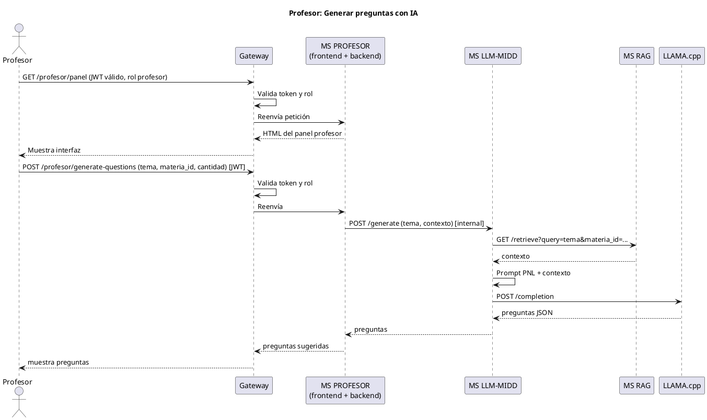

# Profesor: Generar preguntas con IA

```plantuml
@startuml
title Profesor: Generar preguntas con IA

actor Profesor as prof
participant "Gateway" as gw
participant "MS PROFESOR\n(frontend + backend)" as msprof
participant "MS LLM-MIDD" as llmmid
participant "MS RAG" as rag
participant "LLAMA.cpp" as llama

prof -> gw: GET /profesor/panel (JWT válido, rol profesor)
gw -> gw: Valida token y rol
gw -> msprof: Reenvía petición
msprof --> gw: HTML del panel profesor
gw --> prof: Muestra interfaz

prof -> gw: POST /profesor/generate-questions (tema, materia_id, cantidad) [JWT]
gw -> gw: Valida token y rol
gw -> msprof: Reenvía
msprof -> llmmid: POST /generate (tema, contexto) [internal]
llmmid -> rag: GET /retrieve?query=tema&materia_id=...
rag --> llmmid: contexto
llmmid -> llmmid: Prompt PNL + contexto
llmmid -> llama: POST /completion
llama --> llmmid: preguntas JSON
llmmid --> msprof: preguntas
msprof --> gw: preguntas sugeridas
gw --> prof: muestra preguntas
@enduml
```

---
[⬅️ Volver al Índice (INDEX.md)](../INDEX.md) | [🏠 Volver al Inicio (README.md)](../README.md)
