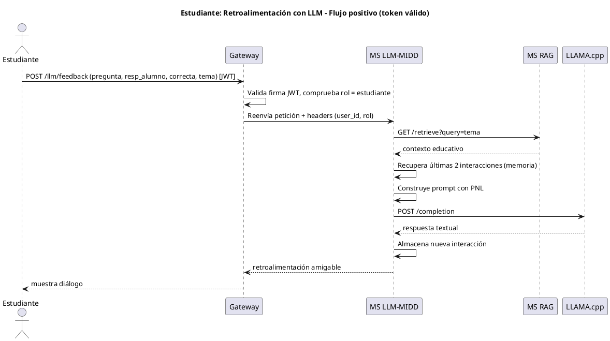

# Estudiante: Retroalimentación con LLM - Flujo positivo (token válido)

```plantuml
@startuml
title Estudiante: Retroalimentación con LLM - Flujo positivo (token válido)

actor Estudiante as est
participant "Gateway" as gw
participant "MS LLM-MIDD" as llmmid
participant "MS RAG" as rag
participant "LLAMA.cpp" as llama

est -> gw: POST /llm/feedback (pregunta, resp_alumno, correcta, tema) [JWT]
gw -> gw: Valida firma JWT, comprueba rol = estudiante
gw -> llmmid: Reenvía petición + headers (user_id, rol)
llmmid -> rag: GET /retrieve?query=tema
rag --> llmmid: contexto educativo
llmmid -> llmmid: Recupera últimas 2 interacciones (memoria)
llmmid -> llmmid: Construye prompt con PNL
llmmid -> llama: POST /completion
llama --> llmmid: respuesta textual
llmmid -> llmmid: Almacena nueva interacción
llmmid --> gw: retroalimentación amigable
gw --> est: muestra diálogo
@enduml
```

---
[⬅️ Volver al Índice (INDEX.md)](../INDEX.md) | [🏠 Volver al Inicio (README.md)](../README.md)
